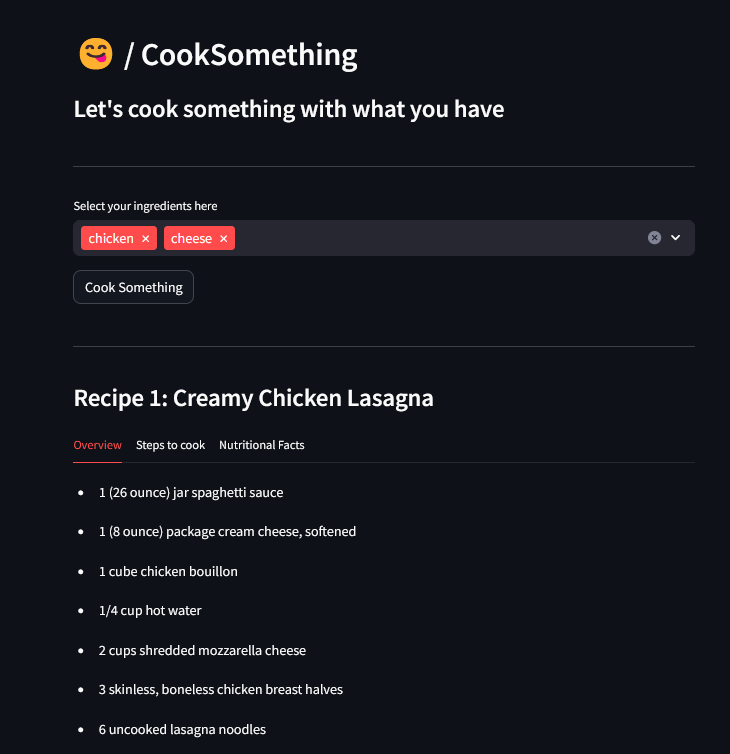

This Project is submitted as the final project of CS50's Introduction to Programming course.
CookSomething is a Recipe Recommendation Web application that uses TF-IDF Vectorizer and cosine similarity to recommend recipes for given ingredients. This project uses Python Programming Language, Flask for backend and Streamlit as the frontend.
